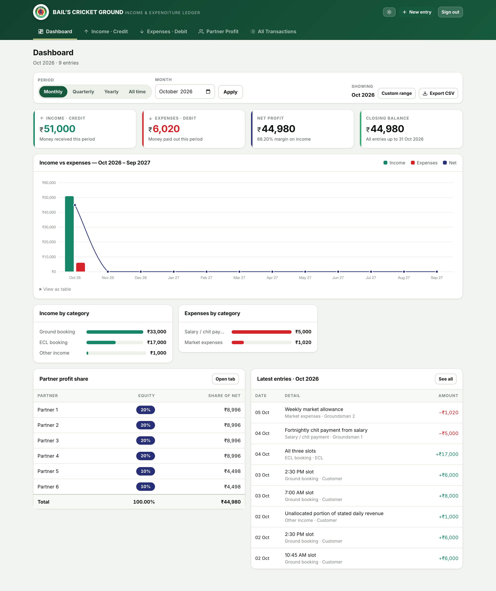
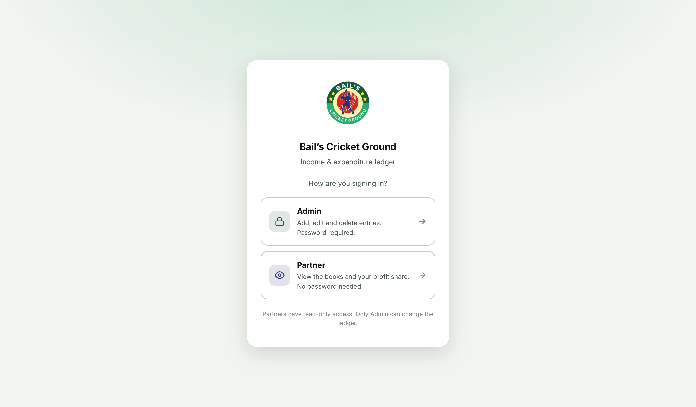

# Bail's Cricket Ground — Income & Expenditure Ledger

A Flask web app for tracking ground bookings (credit) and running costs (debit),
with monthly / quarterly / yearly filters and an automatic profit split across
the six equity partners. Two roles: **Admin** (full control) and **Partner**
(read-only).





---

## Signing in

The start screen asks **how** you are signing in:

| Role | Password | Can do |
|---|---|---|
| **Admin** | `Admin123` | Everything: add, edit and delete entries, and change the equity split |
| **Partner** | none | View only: every tab, every filter, Excel export — no changes |

Partners get a `Partner · view only` badge in the header, and all the add/edit/
delete controls are gone from their screens. That is cosmetic, though — the real
boundary is server-side: every write route is wrapped in `admin_required`, so a
partner who hand-posts a form gets **403**, not a silent success. There are tests
for exactly that on create, edit, delete and the equity form.

> ⚠️ **Partner access has no password, so anyone who can open the URL can read
> the whole ledger** — income, expenses and what each partner earns. That is fine
> on your own machine or a private link, but on a public Render URL it means the
> books are readable by anyone who finds it. If you want a shared code on the
> partner door, set `PARTNER_PASSCODE` and the start screen asks for it. No code
> change needed, and leaving it unset keeps the password-free behaviour.

## What it does

| Tab | What you get |
|---|---|
| **Dashboard** | Income, expenses, net profit and closing balance for the selected period; a 12-month income-vs-expense chart starting at your first month of entries; category breakdowns; partner shares; recent entries |
| **Income · Credit** | Every credit entry for the period (oldest first), with category filter, search, subtotal and per-category bars |
| **Expenses · Debit** | The same for debits |
| **Partner Profit** | Each partner's share of net profit for the period, plus an editable equity split |
| **All Transactions** | Credit and debit together, oldest first, with a running balance that builds downwards |

Admin additionally gets the **New entry** dialog and per-row Edit / Delete; a
partner sees the same figures without any of those controls.

Other features:

- **Period filters** — Monthly, Quarterly, Yearly, All time, or a custom date range. The choice follows you across tabs.
- **The dashboard chart** shows a fixed 12-month window anchored to your first
  month of entries (so a ledger starting Oct 2026 opens on *Oct 2026 – Sep 2027*
  and fills left to right as you add months), rather than trailing backwards into
  empty columns. The window stays put while you change the period filter, and
  only rolls forward once the ledger grows past 12 months.
- **Add / edit / delete** entries from any tab through one dialog. Expense entries can only use expense categories, and vice versa.
- **Excel export** of whatever period is on screen, laid out like your own
  `BailsLedgerBook.xlsx`: a **Dashboard** sheet (income/expense/net tiles, the
  12-month table, standing commitments), a **Transaction Ledger** sheet with the
  same twelve columns and a running balance, plus a **Partner Profit** sheet.
  Rows read oldest-first, the way a ledger book does.
- **Save to Drive** — one click writes that workbook into a folder on this
  machine, replacing the previous copy. Point it at a Google Drive for Desktop
  folder and Drive uploads it for you.
- **Light and dark themes**, remembered per browser.
- **Mobile friendly** — designed to be usable one-handed at the ground.

---

## Quick start (local)

```bash
cd BailsLedger
python3 -m venv .venv
source .venv/bin/activate
pip install -r requirements.txt

# Load the existing Excel ledger (optional but recommended)
python import_excel.py BailsLedgerBook.xlsx

python app.py
```

Open <http://127.0.0.1:5000> and sign in with **`Admin123`**.

Data is stored in `instance/bails_ledger.db` (SQLite). That folder is
git-ignored, so your ledger is never committed.

---

## Deploying to Render

Full walkthrough, including the database choice and how to load your data:
**[DEPLOY.md](DEPLOY.md)**.

The short version: create a free [Neon](https://neon.com) Postgres, then Render
→ **New +** → **Blueprint** → pick the repo → **Apply**. `render.yaml` defines
the service and prompts you for `ADMIN_PASSWORD`, `PARTNER_PASSCODE` and
`DATABASE_URL` (paste the Neon string); `SECRET_KEY` is generated.

> ⚠️ The blueprint uses an **external** database on purpose. Render's own free
> Postgres is **deleted 30 days after creation** with no backups, so for a
> ledger you intend to keep, use Neon (free, non-expiring) — the app needs no
> code change. DEPLOY.md covers both paths.

## Configuration

Every setting is an environment variable. Copy `.env.example` to `.env` for
local use.

| Variable | Default | Purpose |
|---|---|---|
| `ADMIN_PASSWORD` | `Admin123` | The Admin password. **Change this in production.** |
| `PARTNER_PASSCODE` | *(empty)* | Optional shared code for the Partner door. Empty = no password. |
| `SECRET_KEY` | random per boot | Signs the session cookie. Set it so sessions survive restarts. |
| `DATABASE_URL` | unset → SQLite | Postgres connection string. `postgres://` URLs are normalised automatically. |
| `FORCE_HTTPS` | `false` | Set `true` behind HTTPS to mark the session cookie `Secure`. |
| `TRUSTED_PROXY_COUNT` | `0` | How many reverse proxies sit in front. Render uses `1`. |
| `CURRENCY_SYMBOL` | `₹` | Symbol shown throughout the UI. |
| `DRIVE_EXPORT_DIR` | *(unset)* | Folder the Excel export is mirrored into. Unset hides the "Save to Drive" button. |
| `DRIVE_EXPORT_FILENAME` | `BailsLedgerBook.xlsx` | Name of the mirrored file. |

A local `.env` file is loaded automatically; real environment variables win over it.

> **`SECRET_KEY`** signs the session cookie. Set it for any deployment — the app
> refuses to start without it when `DATABASE_URL` is present, because a
> per-process random key would sign each Gunicorn worker's cookies differently
> and log everyone out on every restart. Locally you can omit it: a stable key is
> created once at `instance/secret_key`. `render.yaml` generates one for you.

> **`TRUSTED_PROXY_COUNT`** controls whether `X-Forwarded-For` is believed. At
> `0` the header is ignored entirely, because a client can forge it and a forged
> value must never be able to reset the login throttle. Render puts exactly one
> proxy in front, so `render.yaml` sets this to `1` — that way the throttle sees
> real client addresses instead of lumping everyone behind the proxy IP.

---

## Excel export and Google Drive

**In the app:** the **Export Excel** button downloads the workbook for the period
on screen. Admin also gets **Save to Drive**, which writes it into
`DRIVE_EXPORT_DIR` — replacing the file in place, so that folder always holds the
latest ledger rather than a pile of dated copies. The write goes to a temporary
file first and is then moved into position, so Drive never uploads a
half-written workbook.

**From the command line** (handy for a cron job):

```bash
python sync_drive.py                      # uses DRIVE_EXPORT_DIR, whole ledger
python sync_drive.py --period month --month 2026-10
python sync_drive.py --dir "/path/to/My Drive/BAILS" --name BailsLedgerBook.xlsx
```

The ledger sheet deliberately ships with a frozen header rather than an
autofilter: openpyxl expresses an autofilter as an `_xlnm._FilterDatabase`
defined name, which Excel often rejects with *"We found a problem with some
content"*. Turn filtering on yourself in Excel if you want it.

There is no Google API key or OAuth involved. Google Drive for Desktop already
mounts your Drive as a normal folder, so writing the file there *is* the upload —
Drive syncs it and keeps the previous copy in its own version history.

> The export is a **separate file** from any ledger you already keep in that
> folder. It is generated from this app's database and will not contain anything
> the app does not track (lease totals, amounts paid to date, bank details), so
> it should never be used to overwrite a workbook that holds those.

## Partner profit

Six partners are created on first run — four at **20%** (Vara Prasad, Aravind,
Siva Konderu, Raghavender Hariharan) and two at **10%** (Bhanu, DRR sir), taken
from the *Partner Amounts Paid* sheet of the existing BAILS workbook. Rename them
or adjust the percentages any time on the **Partner Profit** tab.

Net profit for the selected period is `income − expenses`, and each partner
receives `net × equity ÷ 100`. Rounding remainders are given to the largest
stake, so the individual shares always add back to the exact total — no stray
paisa. If the active percentages do not total 100%, the app still calculates
pro-rata and shows a warning with the unallocated amount, rather than silently
misreporting.

A loss is split the same way and clearly labelled as a share of the loss.

---

## Project layout

```
app.py              Flask app: routes, roles/auth, request validation
config.py           Environment-driven configuration
models.py           Partner, Transaction, Setting, roles + the category lists
finance.py          Period parsing, aggregation, partner-share maths
import_excel.py     One-off importer for BailsLedgerBook.xlsx
exporter.py         Builds the .xlsx export (Dashboard / Ledger / Partner Profit)
sync_drive.py       CLI: write the export into a Drive (or any) folder
templates/          Jinja templates (base, dashboard, tabs, dialog, login)
static/css/app.css  Design system — brand palette, light/dark, responsive
static/js/app.js    Entry dialog, theme toggle, delete confirmation
static/js/charts.js Chart.js monthly trend
tests/            165 tests (money, periods, roles, export, audit regressions)
render.yaml         Render blueprint (web service + Postgres)
```

---

## Tests

```bash
python -m pytest -q
```

165 tests cover the money maths (Indian digit grouping, Decimal rounding,
partner splits that must re-sum exactly), period boundaries (leap years,
quarter and year rollover, the 12-month trend walking back across a year
boundary), access control, CSRF, input validation, HTML escaping, and every
route.

---

## Design notes

The palette is taken from the ground's own badge — dark green `#17593C`, green
`#2CAA70`, cream `#FDF4A3`, red `#D72228`, navy `#273076`.

The credit and debit colours used in charts and tables (`#17876A` and
`#D72228`) were **checked rather than eyeballed**: green-vs-red is the classic
colour-blindness trap. This pair measures a deuteranopia separation of
ΔE 10.3 (target ≥ 8) and clears 3:1 contrast against both the light and dark
surfaces. Colour never carries meaning alone either — credit and debit are
always also labelled, signed (`+` / `−`), and arrow-iconed, and every chart has
a "View as table" fallback.

---

## Security

- Two roles. The Admin password is hashed with Werkzeug's PBKDF2 and compared in
  constant time; the optional partner passcode is compared with
  `secrets.compare_digest`.
- **Write access is enforced on the server, not in the templates.** Every
  state-changing route (`/transactions/new`, `/transactions/<id>/edit`,
  `/transactions/<id>/delete`, `/partners/save`) is behind `admin_required` and
  returns 403 for a partner. A session carrying an unknown or missing role is
  treated as signed out rather than trusted.
- CSRF protection on every state-changing request (Flask-WTF).
- Session cookie is `HttpOnly` + `SameSite=Lax`, and `Secure` when `FORCE_HTTPS=true`.
- Login throttling on both doors: 8 failed attempts per address triggers a 5-minute lockout.
  The counter is keyed on `request.remote_addr`, never on a raw `X-Forwarded-For`
  header — otherwise an attacker could vary the header and get a fresh counter on
  every request. A global backstop additionally slows every attempt once a burst
  of failures lands in one window, so rotating source addresses buys rate but not
  speed, and the attempt store is pruned so it cannot be grown by an
  unauthenticated caller.
- Redirect targets are parsed and must have no scheme and no host, so neither
  `//evil.com` nor a control-character trick such as `/\tevil.com` can leave the site.
- An expired or missing CSRF token returns you to the page with a message instead
  of a bare 400, and tokens last as long as the session rather than one hour.
- All user input is escaped by Jinja autoescaping; amounts, dates and types are validated server-side.

### How this was verified

The app was audited by 5 parallel reviewers (security, money correctness,
Flask/SQLAlchemy/deployment, templates/accessibility, front-end), and every
finding was then put to 3 independent skeptics instructed to refute it. 41 raw
findings became **17 confirmed and 24 refuted**; all 17 are fixed, and each one
has a regression test in `tests/test_audit_regressions.py` that reproduces the
original failure. The throttle bypass was re-confirmed fixed against a live
server: 30 brute-force attempts with a rotating `X-Forwarded-For` now lock out at
attempt 9, where previously none of the 30 were blocked.

This is a single-operator tool, so there are no separate user accounts. If you
later need per-partner logins with read-only access, that is the natural next step.
